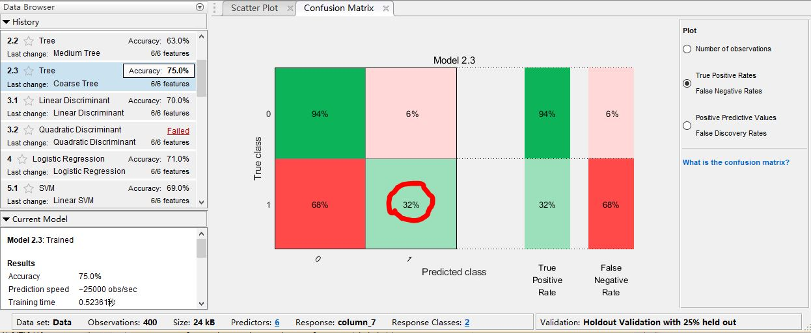

# This is a bad attempt for ‘Udacity - Self-Driving Car NanoDegree: Introduction to Neural Networks’ with MATLAB's 'classificationLearner'

I got a bad result with MATLAB’s most recent tool ‘classificationLearner’. It has only the accuracy of 75%. The classification for students who will be accepted by a university are a mess with the accuracy of 32%. 

There could be two reasons. One is that I have misused the toolbox of MATLAB. I learn it from [‘Machine Learning Made Easy’](https://cn.mathworks.com/videos/machine-learning-with-matlab-100694.html?form_seq=YQ6cFtgE) and [‘Signal Processing and Machine Learning Techniques for Sensor Data Analytics’](https://cn.mathworks.com/videos/signal-processing-and-machine-learning-techniques-for-sensor-data-analytics-107549.html?form_seq=ME58CSi0). Another is more advanced technologies should be used. 

I should learn more. 

------------

Blue Bird

Best Wishes
